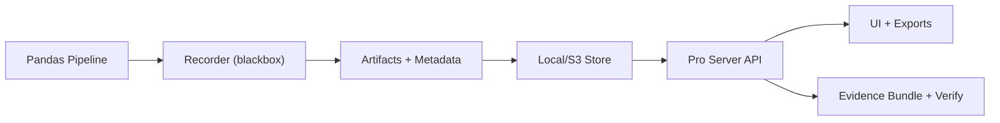

# Blackbox Data

Blackbox Data is a lightweight, tamper-evident forensic recorder for pandas data pipelines. It captures what changed between steps, stores optional artifacts, and produces a verifiable audit trail.

## Why It Exists
- You need step-by-step change evidence for datasets.
- You want reproducible, investigation-friendly logs.
- You need tamper-evident integrity for pipeline output.

## Core Features
- Run and step metadata (`run.json`, `step.json`).
- Schema diff (added, removed, dtype changes).
- Rowhash diff (added, removed, changed keys).
- Snapshot artifacts (Parquet) with size controls.
- Tamper-evident hash chain.
- CLI for listing, verification, and reports.
- Engine adapters: pandas, Polars, PyArrow, DuckDB (SQL).

## Architecture


## Quickstart
One-command quickstart:
```bash
python3 -m venv .venv && source .venv/bin/activate && python3 -m pip install -U pip && python3 -m pip install -e ".[pro]" && blackbox-pro serve --host 0.0.0.0 --port 8088
```

Local dev (step-by-step):
```bash
python3 -m venv .venv
source .venv/bin/activate
python3 -m pip install -U pip
python3 -m pip install -e ".[pro]"
```

Non‑technical quickstart (guided):
```bash
blackbox-pro wizard
```

Simplest start (auto token file):
```bash
blackbox-pro start
```

Warehouse adapters:
```bash
python3 -m pip install -e ".[pro,warehouse]"
```

Optional engines (Polars + DuckDB):
```bash
python3 -m pip install -e ".[pro,engines]"
```

```python
import pandas as pd
from blackbox import Recorder, Store, DiffConfig, SnapshotConfig, SealConfig, RecorderConfig

store = Store.local("./.blackbox_store")
rec = Recorder(
    store=store,
    project="acme-data",
    dataset="demo",
    diff=DiffConfig(mode="rowhash", primary_key=["id"], diff_mode="rows"),
    snapshot=SnapshotConfig(mode="auto", max_mb=5),
    seal=SealConfig(mode="chain"),
    config=RecorderConfig(parquet_compression="zstd"),
)

run = rec.start_run(tags={"env": "local"})

df0 = pd.DataFrame({"id": [1, 2, 3], "score": [10, 20, 30]})
with run.step("normalize", input_df=df0) as st:
    df1 = df0.copy()
    df1["score"] = df1["score"] / 10.0
    st.capture_output(df1)

run.finish()
ok, msg = run.verify()
print(ok, msg)
```

## CLI
List runs:
```bash
blackbox --root ./.blackbox_store list --project acme-data --dataset demo
```

Report:
```bash
blackbox --root ./.blackbox_store report --project acme-data --dataset demo --run-id <RUN_ID>
```

Verify:
```bash
blackbox --root ./.blackbox_store verify --project acme-data --dataset demo --run-id <RUN_ID>
```

Beginner-friendly Pro CLI:
```bash
blackbox-pro start
blackbox-pro demo
blackbox-pro wizard
```

Run any pipeline without code changes:
```bash
blackbox --root ./.blackbox_store wrap --project acme-data --dataset demo -- python pipeline.py
```

## Diff Controls
- `DiffConfig.diff_mode`: `rows` (default), `schema`, `keys-only`.
- `DiffConfig.summary_only_threshold`: summarize only when churn is high.
- `DiffConfig.chunk_rows`: chunked diffing for large datasets.
- `DiffConfig.hash_group_size` and `DiffConfig.parallel_groups`: wide-frame hashing.
- `DiffConfig.auto_parallel_wide`, `auto_parallel_threshold_cols`, `auto_parallel_workers`, `auto_hash_group_size`: auto-parallel hashing for wide frames.
- `DiffConfig.cache_rowhash`: reuse rowhashes between adjacent steps.
- `DiffConfig.auto_parallel_wide`: auto-enable parallel hashing for wide frames.
- `DiffConfig.native_polars`: experimental native Polars hashing (if Polars inputs).

## Snapshot Controls
- `SnapshotConfig.mode`: `none`, `auto`, `always`.
- `SnapshotConfig.max_mb`: max artifact size when `auto`.
- `RecorderConfig.parquet_compression`: `snappy`, `zstd`, `gzip`, `lz4`, `none`.
- `RecorderConfig.snapshot_async`: background snapshot writes for smoother UX.

## Performance Envelope
Optimized for up to ~1M rows per step. Larger datasets are supported via chunking.
Use `DiffConfig.chunk_rows` (for example, `250_000`) to reduce peak memory and improve progress reporting.

## Benchmarks
Run micro-benchmarks and write JSON/CSV outputs:
```bash
.venv/bin/python -m benchmarks.run_benchmarks --sizes 1000000 --wide-cols 50 --runs 3 --warmup 1 \
  --output reports/benchmarks.json --output-csv reports/benchmarks.csv
```
Results summary: `BENCHMARKS.md`.

## Installation + Deployment
Supported Python: 3.10, 3.11, 3.12.  
Tested OS: macOS, Linux.

Docker quickstart:
```bash
docker build -t blackbox-data .
docker run -p 8088:8088 \
  -e BLACKBOX_PRO_TOKEN=your-token \
  -e BLACKBOX_PRO_ROOT=/data/.blackbox_store \
  -v $(pwd)/.blackbox_store:/data/.blackbox_store \
  blackbox-data
```

Docker Compose:
```bash
docker compose up -d
```

Export a full run bundle:
```bash
blackbox-pro export --project acme-data --dataset demo --run <run_id> --format zip
```

Environment variables:
- `BLACKBOX_PRO_TOKEN`: bearer token for API + UI
- `BLACKBOX_PRO_TOKENS`: multi-tenant tokens (`role@tenant1|tenant2:token`)
- `BLACKBOX_PRO_ROOT`: store root path
- `BLACKBOX_PRO_TOKEN_FILE`: read token(s) from file
- `BLACKBOX_PRO_ALLOW_DEV_TOKEN`: enable legacy `dev-secret-token` (not recommended)
- `BLACKBOX_PRO_OIDC_ISSUER`: OIDC issuer URL (Auth0/Okta/Azure AD)
- `BLACKBOX_PRO_OIDC_AUDIENCE`: OIDC audience
- `BLACKBOX_PRO_OIDC_JWKS_URL`: override JWKS URL
- `BLACKBOX_WAREHOUSE_CONFIG`: warehouse config YAML path

## Security Model
- API uses Bearer token auth; UI routes accept `?token=` for convenience.
- Treat tokens as secrets; scope tokens to tenants when possible.
- Evidence bundles + audit hash chains provide tamper-evident integrity.

## Cybersecurity Applications
- **Forensic integrity:** detect tampering in pipeline outputs with hash‑chain verification.
- **Incident response:** export evidence bundles for post‑incident review and audit.
- **Data poisoning defense:** highlight unexpected drift or high churn changes.
- **Compliance alignment:** supports SOC2/ISO evidence workflows.

## Enterprise Extensions
- OIDC/JWT auth + multi-tenant RBAC
- Warehouse adapters (Snowflake, BigQuery, Redshift, Postgres/MySQL)
- Usage dashboards (`/ui/metrics`)

## Versioning
Semantic-ish versioning with release notes in `CHANGELOG.md`.

## Positioning vs Adjacent Tools
Blackbox Data focuses on forensic change evidence for pandas pipelines. It is complementary to adjacent categories such as:
- Data validation suites (for example, Great Expectations).
- Data version control tools (for example, DVC, lakeFS).
- Lineage/event standards (for example, OpenLineage).
- Data observability platforms.

If you already use any of these, Blackbox Data can act as the step-level evidence layer in your pipeline.

## Local Store Layout
```
<root>/<project>/<dataset>/<run_id>/
  run.json
  run_start.json
  run_finish.json
  chain.json
  events.jsonl (optional)
  steps/<ordinal>_<name>/
    step.json
    artifacts/
      input*.bbdata
      output*.bbdata
      diff.bbdelta
```

## Benchmarks
See `benchmarks/README.md` for benchmark, load, stress, and security runs and CSV outputs.

## Testing
Core coverage includes:
- auth enforcement
- UI rendering
- tamper detection
- end-to-end run → report
Run the full suite with:
```bash
.venv/bin/python -m pytest
```

## Repository Layout
- `blackbox/`: core recorder + diffing engine
- `blackbox_pro/`: API + UI server
- `bb/`: CLI entrypoint
- `docs/`: product docs + guides
- `examples/`: demo pipelines
- `benchmarks/`: performance + security test harness
- `scripts/`: utilities (screenshots, Schemathesis runs)
- `tests/`: pytest coverage
- `config/`: example configs (warehouses)
- Policy controls: max run size, prod verification, retention windows (see `RecorderConfig`)
