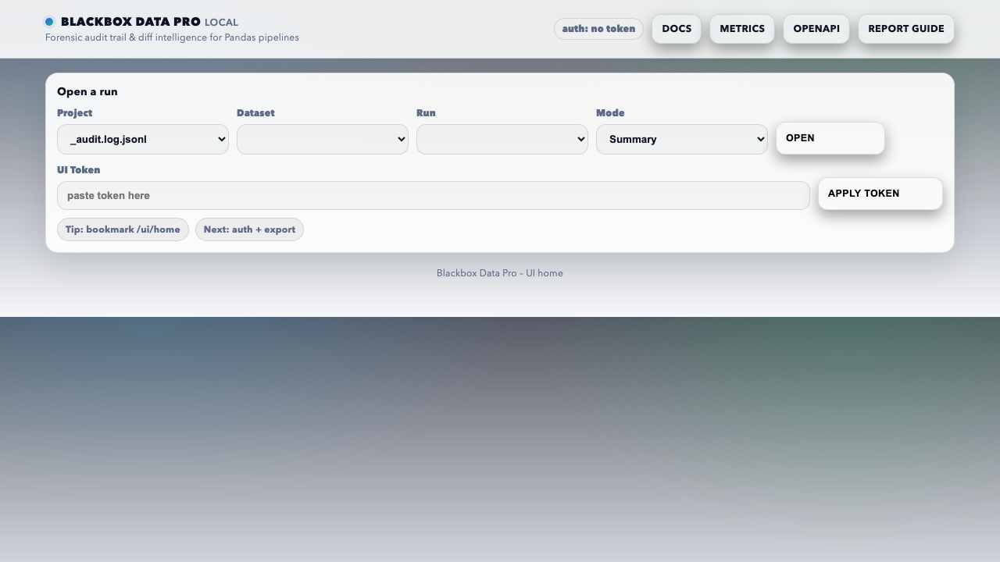
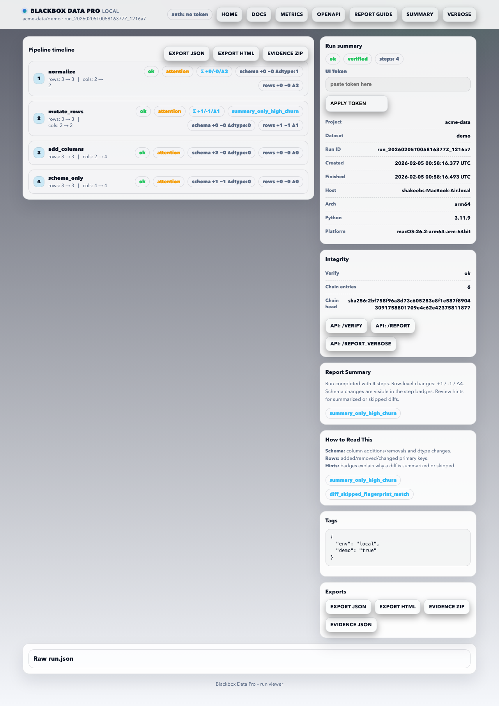

# Non‑Technical Quickstart

## Goal
See a demo run in the UI without touching code.

## Step 1 — Start the server
```bash
blackbox-pro start
```

## Step 2 — Log in once
Open:
```
http://127.0.0.1:8088/ui/login
```
Paste the token shown in your terminal.

## Step 3 — Generate a demo run
```bash
blackbox-pro demo
```

## Step 4 — Open the UI
```
http://127.0.0.1:8088/ui/home
```
Click **Open** to view the report.

---

## What to look for
- **Verified** = evidence chain is intact.
- **Attention** = changes detected in that step.
- **Download Evidence Package** = shareable audit ZIP.

### Screenshots


