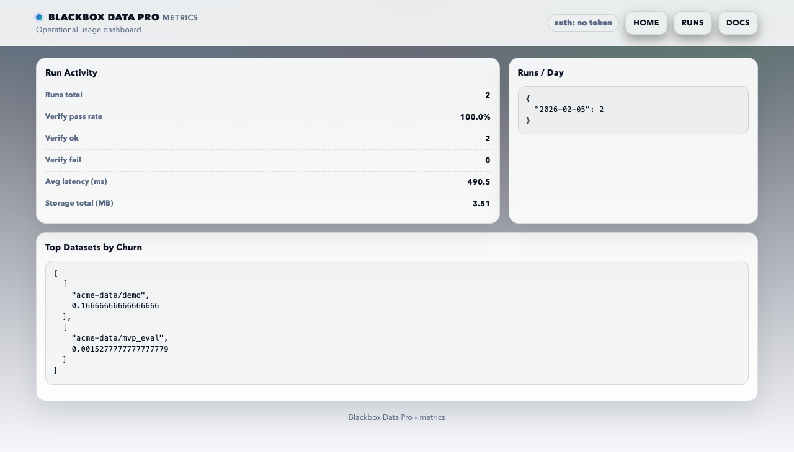

# Blackbox Data Pro v1.0-rc1 Release Notes

Date: 2026-02-05

## Summary
This RC focuses on stability, security, and performance for audit‑grade pipeline
diffing. It includes evidence bundles with signing/verification, audit log hash
chains, multi-tenant auth, and a polished UI with exportable reports.

## Highlights
- Evidence bundles (ZIP) with optional HMAC and PGP signatures
- Audit log chaining + verification tooling
- Multi-tenant token auth + SSO/JWT support
- Report UI with summaries, drill‑downs, and exports (JSON/CSV/HTML)
- Benchmarked diffing performance with wide‑frame improvements

## Screenshots

## Quality Gates (RC)
- Unit tests: passing (28/28)
- Schemathesis: clean run with seeded data + deserializers
- Bandit (SAST): clean
- pip-audit: clean

## Known Limitations
- Schemathesis may warn without seeded run data
- JSONL/ZIP response validation requires custom deserializers (provided)

## Upgrade Notes
- Build system requires `setuptools>=78.1.1`

## Next
- Expand integration guides
- Beta feedback on UX and workflow fit
