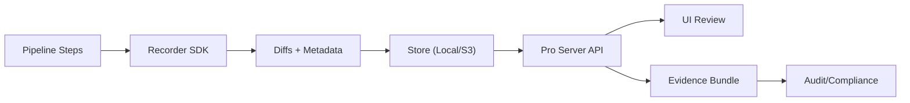
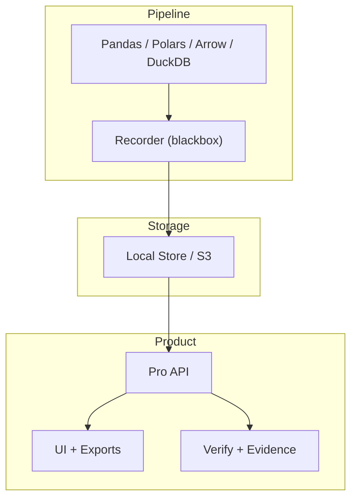

# Blackbox Data Pro — Business Deck

---
## Title
**Blackbox Data Pro**  
Forensic Audit Trails + Diff Intelligence for Data Pipelines

---
## Workflow (Visual)

---
## Architecture (Visual)

---
## Problem
- Data pipelines change invisibly.
- Root-cause analysis is slow and incomplete.
- Compliance needs tamper‑evident evidence.

---
## What We Do
- Capture what changed between steps.
- Provide tamper‑evident evidence.
- Make audits fast and defensible.

---
## Product Overview
- Recorder SDK for pipelines
- Pro Server + UI for browsing diffs
- Evidence bundle export (ZIP)
- Verification endpoint + CLI

---
## Differentiation
- Forensic clarity, not just validation
- Small footprint (metadata + diffs)
- Audit‑grade integrity chain

---
## Security Use Cases
- Tamper‑evident evidence for incident response  
- Detect unexpected churn (data poisoning / manipulation)  
- Exportable proof for audits and compliance  
- SIEM‑friendly audit logs  

---
## Enterprise Readiness
- Token auth + RBAC + multi‑tenant
- OIDC / JWT support
- Audit log export (SIEM)

---
## Performance
- Optimized for up to ~1M rows per step
- Adaptive diffing skips no‑op runs
- Parallel hashing for wide frames

---
## Deployment
- Local server (pip or docker)
- Storage: local or S3
- UI + API in one container

---
## Business Value
- Cuts investigation time
- Improves compliance posture
- Increases confidence in data

---
## Demo Scenarios
- Detect silent data poisoning before model training  
- Audit trail for financial reporting dataset  

---
## Call to Action
- Try a demo run in minutes
- Review pipeline changes in the UI
